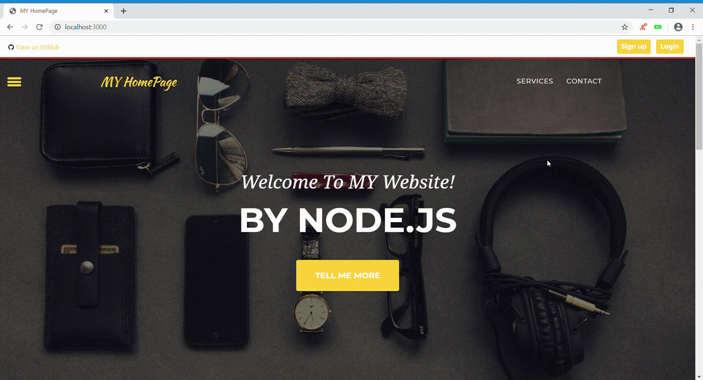
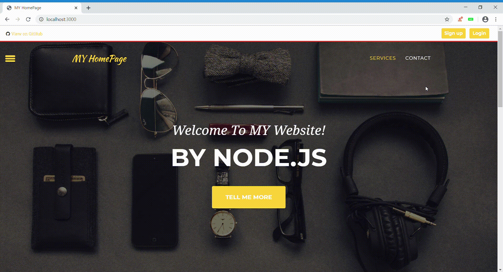

My Web
===

Node.js 내 웹사이트

 

웹사이트 구성
---

| 메인화면 |
|:----------------------------------------:|
||

| 회원가입 |
|:----------------------------------------:|
||

| 로그인 |
|:----------------------------------------:|
||

| 게시판 |
|:----------------------------------------:|
||

| 전화번호부 |
|:----------------------------------------:|
||
